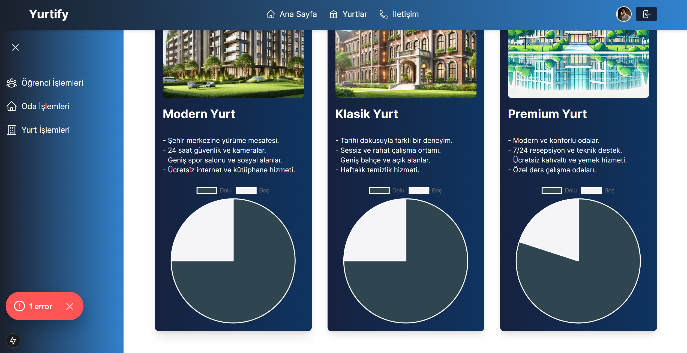
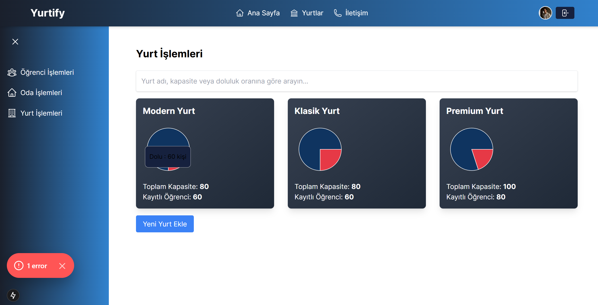
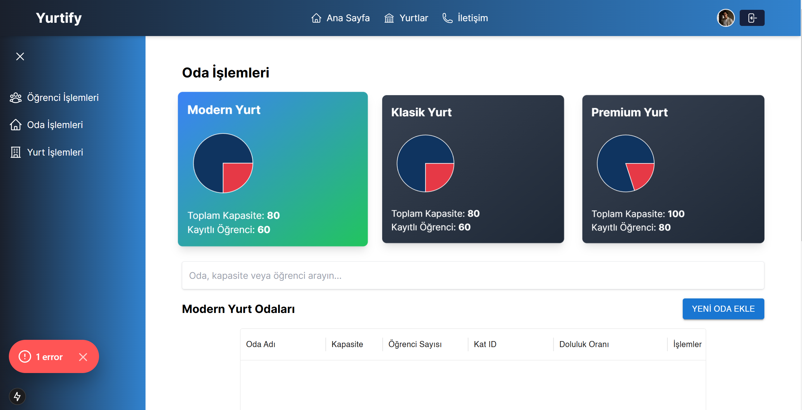
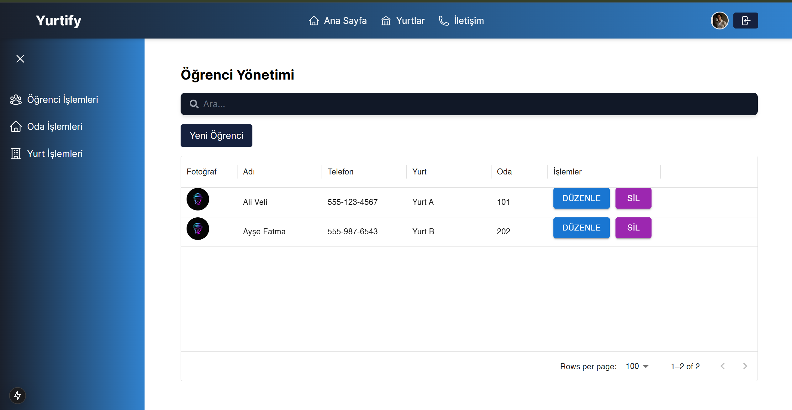
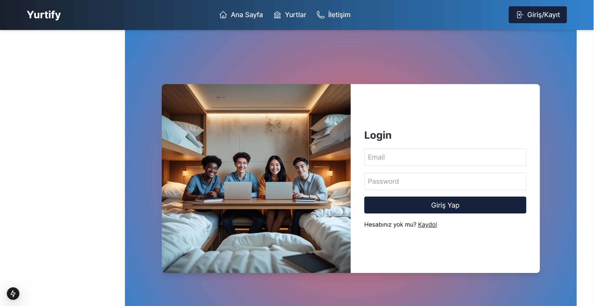

# Yurtify - Dormitory Management Application

Yurtify is a modern dormitory management application designed to streamline the administration of dormitories, rooms, and student data. The app enables users to perform CRUD operations, visualize occupancy rates, and explore dormitory details through a sleek and user-friendly interface. This README provides details on features, setup instructions, and placeholders for screenshots and templates.

---

## Features

- **Authentication:**
  - Secure user authentication with role-based access control.
  - Admins can manage dormitories, rooms, and students, while users can view details.

- **Dormitory Management:**
  - Add, edit, and delete dormitories with detailed information.
  - Visualize dormitory occupancy rates through dynamic charts.

- **Room Management:**
  - Manage rooms by floor, capacity, and occupancy.
  - Assign and manage students in rooms based on available space.

- **Student Management:**
  - Add, edit, and delete student records.
  - Associate students with rooms and track their information.

- **Real-time Search and Filtering:**
  - Perform keyword-based searches across dormitories, rooms, and students.

- **Dynamic Data Visualization:**
  - Occupancy rates displayed using modern and interactive charts.

- **Responsive Design:**
  - Fully optimized for mobile and desktop devices with a responsive layout.

---

## Screenshots

Here are placeholders for application screenshots:

| Dashboard               | Dormitory Details        | Room Management         |
|-------------------------|--------------------------|-------------------------|
|  |  |  |

| Student Management      | Main Page           | Login               |
|-------------------------|--------------------------|-------------------------|
|  |  |  |

---

## Template Design Placeholder

If you're working on dormitory-related templates, add screenshots or template details here:

| Template Design 1       | 
|-------------------------|
|  | 

---

## Installation

To get started with this project, follow these steps:

1. **Clone the repository:**

   ```bash
   git clone https://github.com/yourusername/Yurtify.git
   cd Yurtify
   ```

2. **Install dependencies:**

   ```bash
   npm install
   ```

3. **Run the development server:**

   ```bash
   npm run dev
   ```

4. **Visit the application:**
   Open your browser and navigate to [http://localhost:3000](http://localhost:3000).

---

## Technologies Used

- **Frontend:**
  - **Next.js:** A React framework for server-side rendering and static site generation.
  - **Tailwind CSS:** A utility-first CSS framework for rapid UI development.
  - **Framer Motion:** A powerful animation library for React.
  - **Heroicons:** Modern and minimalistic SVG icons.

- **Backend:**
  - **Java Spring Boot:** A robust framework for building REST APIs.
  - **PostgreSQL:** A powerful, open-source relational database.
  - **Hibernate:** An ORM tool for managing database relationships.

- **Charts:**
  - **Recharts:** A modern chart library for data visualization.

- **Other Tools:**
  - **Axios:** For handling HTTP requests.
  - **UUID:** For generating unique identifiers.
  - **Dynamic Routing:** Enabled by Next.js file-based routing.

---

## Contribution

1. Fork the repository.
2. Create a new branch (`git checkout -b feature/your-feature-name`).
3. Commit your changes (`git commit -m 'Add some feature'`).
4. Push to the branch (`git push origin feature/your-feature-name`).
5. Open a pull request.

---

## License

This project is licensed under the MIT License - see the [LICENSE](LICENSE) file for details.
